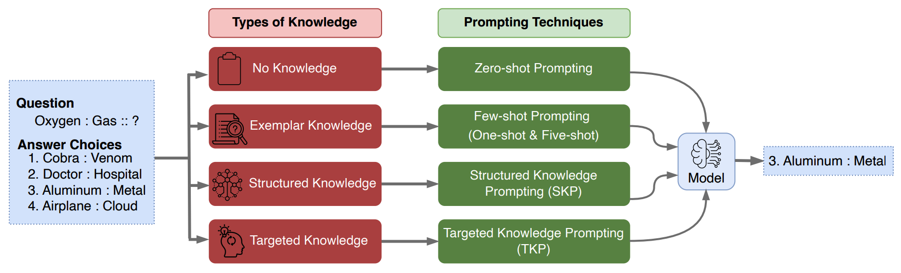
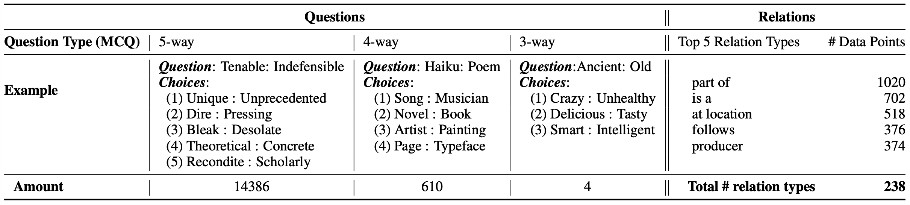
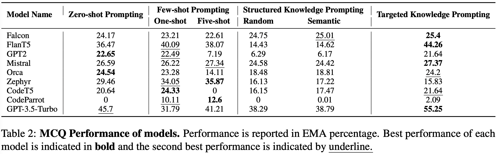

# KnowledgePrompts: Exploring the Abilities of Large Language Models to Solve Proportional Analogies via Knowledge-Enhanced Prompting

This repo will provide the resources for our paper: [Exploring the Abilities of Large Language Models to Solve Proportional Analogies via Knowledge-Enhanced Prompting](https://arxiv.org/abs/2412.00869) (COLING, 2025).

## Overview
Analogies are a cornerstone of human cognition, and proportional analogies, like “Oxygen is to Gas as Aluminum is to Metal,” provide a unique lens for assessing linguistic and cognitive abilities. `KnowledgePrompts` introduces a new 15K Multiple-Choice Question Answering (MCQA) dataset for proportational analogy completion and extensively evaluates how LLMs perform on this dataset via various knowledge-enchanced prompt settings.



## Contributions
* 📚 We introduce a 15K Multiple-Choice Question Answering (MCQA) dataset for proportional analogy completion.
* 🤖 We evaluate how contemporary Large Language Models (LLMs) perform in various knowledge-enhanced prompt settings.
* 💡 We explore three types of knowledge augmentation: exemplar, structured, and targeted.
* 📊 Despite extensive training data, proportional analogy-solving remains challenging, with the best model achieving 55% accuracy.
* 🔍 Targeted knowledge proved to be the most effective strategy for assisting LLMs in completing proportional analogies.

## Dataset Statistics
The dataset consist of 15K MCQs that share 238 semantic relation types among them.




## Results




## Citation
Please use the following citation if you find our work helpful:
```
@inproceedings{wijesiriwardene2024exploring,
  title = {KnowledgePrompts: Exploring the Abilities of Large Language Models to Solve Proportional Analogies via Knowledge-Enhanced Prompting},
  author = {Wijesiriwardene, Thilini and Wickramarachchi, Ruwan and Vennam, Sreeram and Jain, Vinija and Chadha, Aman and Das, Amitava and Kumaraguru, Ponnurangam and Sheth, Amit},
  booktitle = {The 31st International Conference on Computational Linguistics (COLING 2025)},
  year = {2025},
}
```

